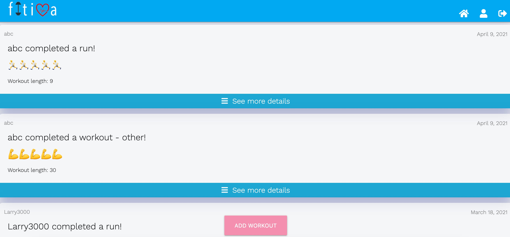

This fitness blog app not only helps you keep track of your workout routines, but it also allows you to share your workout routines with your friends. This in return not only creates a collaborative community, but can help increase your motivation to exercise when seeing others user’s workout routines. 
---
<Row>
Access my code and README on Github 

</Row>

---
## TECHNOLOGIES USED
1. Django
2. Python
3. CSS
4. PostgreSQL

## FUNCTIONALITIES 
1. Full CRUD Features
2. Django Authentication

<Row>
<Col>

</Col>
<Col>

</Col>
</Row>

<Row>
<Col>

</Col>
<Row>
<Col>

</Col>
</Row>
</Row>
