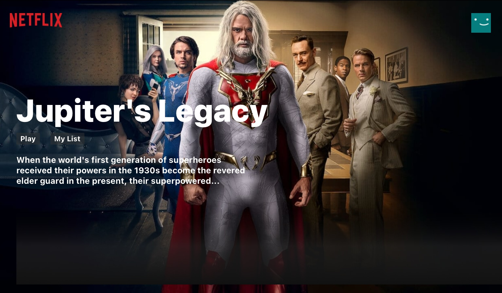
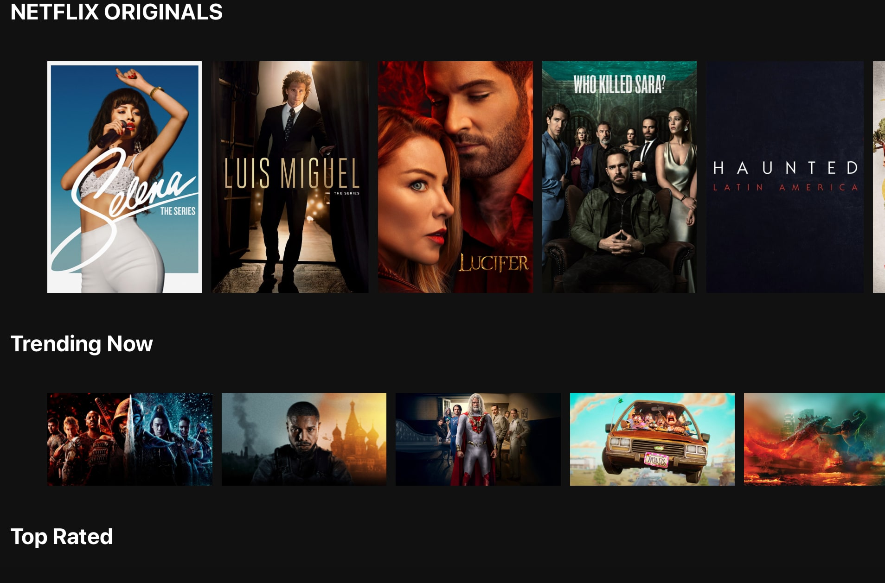

<Row>
Why create a clone website?
</Row>
I needed to have a keen eye for layout and color details in order to match the animations according to its original specifications. 
Being able to accurately convert a design of a popular website allowed me to become proficient at translating mockups and prototypes to webpages.  

<Row>
Access my code and README on Github  

</Row>

---
## TECHNOLOGIES USED
1. JavaScript
2. React
3. CSS
4. TMDB API Movie Database
5. Firebase for deployment

<Row>
<Col>

</Col>
<Col>

</Col>
</Row>

<Row>
<Col>

</Col>
<Col>

</Col>
</Row>

<Row>
<Col>

</Col>
<Col>

</Col>

<Col>

</Col>
</Row>